# AI-Powered Research Data Collection System - Backend

[](https://nodejs.org/)
[](https://postgresql.org/)
[](https://cloud.google.com/)
[](https://africastalking.com/)
[](https://redis.io/)
[](LICENSE)

> AI-powered research data collection via USSD & Voice, leveraging Google Gemini AI and Africa's Talking APIs to democratize research access across Africa.

**Production URL:** `https://research-system-864580156744.us-central1.run.app`

## Overview

This backend system enables researchers to collect qualitative data from any mobile phone using USSD and Voice calls, with AI-powered transcription and analysis. No internet or smartphone required for participants.

**Deployed on Google Cloud Run** with automatic scaling, Redis caching, and comprehensive monitoring. The system handles thousands of concurrent USSD sessions and voice calls with real-time AI processing.

## Key Features

- **USSD Interface** - Interactive menu system accessible via `*384*34153#`
- **Voice Recording** - Automated IVR for voice responses with call recording
- **Google Gemini AI** - Automatic transcription, summarization & sentiment analysis
- **Africa's Talking Integration** - SMS, USSD, and Voice APIs
- **Redis Caching** - High-performance response caching with TTL management
- **Multilingual Support** - English and Swahili with dynamic language switching
- **Real-time Analytics** - Dashboard with insights, charts, and export capabilities
- **Role-based Access** - Admin, Researcher, and Viewer roles with JWT authentication
- **SMS Notifications** - Automated thank you messages and research invitations
- **Public API** - RESTful endpoints for frontend integration
- **Docker Support** - Containerized deployment with Docker Compose
- **Cloud Deployment** - Production-ready on Google Cloud Run with auto-scaling

## Tech Stack

- **Runtime:** Node.js 18+ with Express.js
- **Database:** PostgreSQL 13+ with connection pooling
- **Caching:** Redis for session and data caching
- **AI Services:** Google Gemini AI (gemini-1.5-flash)
- **Telecom:** Africa's Talking (USSD, Voice, SMS)
- **Authentication:** JWT with secure token management
- **Deployment:** Docker + Google Cloud Run

---

## Quick Start

### Prerequisites

- Node.js 18+
- PostgreSQL 13+
- Redis (optional, for caching)
- Google Cloud Platform account (for Gemini AI)
- Africa's Talking account (for USSD/Voice/SMS)

### Installation

```bash
# Clone the repository
git clone <repository-url>
cd research-assistence-back

# Install dependencies
npm install
```

### Environment Setup

```bash
cp .env.example .env
```

Edit `.env` with your credentials:

```env
# Server Configuration
NODE_ENV=development
PORT=3000

# Database Configuration
DB_HOST=localhost
DB_PORT=5432
DB_NAME=research_system
DB_USER=postgres
DB_PASSWORD=your_password

# Redis Configuration (optional)
REDIS_HOST=localhost
REDIS_PORT=6379
REDIS_PASSWORD=

# Google Gemini AI
GEMINI_API_KEY=your_gemini_api_key

# Africa's Talking
AT_USERNAME=sandbox
AT_API_KEY=your_africastalking_api_key

# JWT Secret
JWT_SECRET=your_secure_random_string
```

### Database Setup

```bash
# Create database
createdb research_system

# Run migrations (create tables)
npm run db:migrate

# Seed with sample data
npm run db:seed
```

### Start Development Server

```bash
npm run dev
```

Server will be running at `http://localhost:3000`

## Architecture

```mermaid
graph TB
    A[USSD Users *384*34153#] --> D[Nginx Proxy]
    B[Voice Users 📞] --> D
    C[Researchers 🖥️] --> D
    
    D --> E[Node.js Application]
    
    E --> F[USSD Service]
    E --> G[Voice Service] 
    E --> H[AI Service]
    
    H --> I[Google Gemini AI]
    H --> J[Google Speech-to-Text]
    
    E --> K[(PostgreSQL Database)]
    E --> L[Africa's Talking APIs]
    
    style I fill:#4285f4,stroke:#333,stroke-width:2px,color:#fff
    style J fill:#4285f4,stroke:#333,stroke-width:2px,color:#fff
```



## USSD Flow Example

```
User dials: *384*34153#

┌─────────────────────────────────────┐
│ Research Information System         │
│                                     │
│ 1. Research Information             │
│ 2. Answer Research Questions        │
│ 3. Record Voice Response            │
│ 4. Listen to Research Summary       │
│ 5. Change Language / Badili Lugha   │
│ 0. Exit                             │
└─────────────────────────────────────┘

User selects: 2

┌─────────────────────────────────────┐
│ Select a question to answer:        │
│                                     │
│ 1. Community Health                 │
│ 2. Education Access                 │
│ 3. Economic Opportunities           │
│ 0. Back to Main Menu                │
└─────────────────────────────────────┘
```

## AI Processing Pipeline


## API Endpoints

### USSD Endpoints
```http
POST /ussd/callback
Content-Type: application/x-www-form-urlencoded

sessionId=test123&serviceCode=*384*34153#&phoneNumber=+254712345678&text=
```

### Voice Endpoints
```http
POST /voice/callback
POST /voice/recording
POST /voice/status
```

### API Endpoints
```http
GET /api/health
GET /api/questions
GET /api/responses
GET /api/analytics
```

### SMS Endpoints
```http
POST /sms/thank-you      # Send thank you SMS (Admin/Researcher)
POST /sms/invite         # Send research invitations (Admin/Researcher)  
POST /sms/bulk           # Send bulk SMS (Admin only)
GET /sms/statistics      # Get SMS statistics
POST /sms/delivery-report # SMS delivery webhook
```

## Testing

### Test USSD with Postman

1. **Initial Request (Main Menu)**
```http
POST http://localhost:3000/ussd/callback
Content-Type: application/x-www-form-urlencoded

sessionId=test123
serviceCode=*384*34153#
phoneNumber=+254712345678
text=
```

2. **Select Research Questions**
```http
POST http://localhost:3000/ussd/callback
Content-Type: application/x-www-form-urlencoded

sessionId=test123
serviceCode=*384*34153#
phoneNumber=+254712345678
text=2
```

### Run Test Suite
```bash
npm test                    # Run all tests
npm run test:coverage       # Run with coverage
npm run test:integration    # Integration tests
```

## Docker Deployment

### Development
```bash
docker-compose up -d
```

### Production
```bash
# Build production image
docker build -t research-system .

# Run with production config
docker run -d \
  --name research-system \
  -p 3000:3000 \
  --env-file .env.production \
  research-system
```

## Features Overview

| Feature | Status | Description |
|---------|--------|-------------|
| 📱 USSD Interface | ✅ | Interactive menu system |
| 📞 Voice Recording | ✅ | Automated call system |
| 🤖 Gemini AI | ✅ | Text analysis & summaries |
| 🎤 Speech-to-Text | ✅ | Google Cloud STT |
| 🌍 Multilingual | ✅ | English & Swahili |
| 📊 Analytics | ✅ | Real-time dashboard |
| 🔒 Security | ✅ | JWT, rate limiting |
| 🐳 Docker | ✅ | Container deployment |

## Database Schema

The system uses PostgreSQL with the following main tables:

| Table | Purpose |
|-------|---------|
| `users` | System administrators and researchers |
| `research_questions` | Survey questions (multilingual) |
| `research_responses` | User responses via USSD/Voice |
| `ussd_sessions` | USSD session management |
| `voice_calls` | Voice call tracking |
| `transcriptions` | AI speech-to-text results |
| `ai_summaries` | Gemini AI analysis results |
| `research_campaigns` | Research project management |
| `participants` | User demographics (optional) |

### Database Commands

```bash
# Setup database from scratch
npm run db:migrate    # Create all tables and indexes
npm run db:seed       # Add sample questions and admin user

# Quick reset (development)
npm run db:reset      # Drop, recreate, and seed

# Production backup
pg_dump research_system > backup_$(date +%Y%m%d).sql
```

## Multilingual Support

The system supports multiple languages with easy extensibility:

- **English** - Complete interface and voice prompts
- **Swahili** - Full translation for East African users
- **Dynamic Language Switching** - Users can change language mid-session

## Performance Metrics

- **USSD Response Time:** < 2 seconds
- **Voice Processing:** < 30 seconds with Gemini AI
- **Concurrent Users:** 1000+ USSD sessions
- **Transcription Accuracy:** 95%+ with Google Speech-to-Text
- **Uptime Target:** 99.9%

## Security Features

- **JWT Authentication** with secure token management
- **Rate Limiting** on all endpoints (configurable)
- **Input Validation** and sanitization
- **SQL Injection Prevention** with parameterized queries
- **XSS Protection** with Helmet.js security headers
- **HTTPS Enforcement** in production
- **Role-based Access Control** (Admin/Researcher/Viewer)

## Documentation

- [API Documentation](docs/API.md) - Complete API reference with examples
- [Deployment Guide](docs/DEPLOYMENT.md) - Production deployment to Google Cloud Run
- [Testing Guide](docs/TESTING.md) - Testing procedures and best practices
- [Redis Caching](docs/REDIS_CACHING.md) - Caching strategy and configuration
- [Security Guide](docs/SECURITY.md) - Security best practices and implementation
- [Google Cloud Run](docs/GOOGLE_CLOUD_RUN.md) - Cloud deployment guide
- [Evaluation Guide](docs/EVALUATION.md) - System evaluation and metrics

## Development

### Available Scripts

```bash
npm run dev          # Start development server
npm run start        # Start production server
npm run test         # Run tests
npm run lint         # Run ESLint
npm run db:migrate   # Run database migrations (create tables)
npm run db:seed      # Seed database with sample data
npm run db:reset     # Reset database (migrate + seed)
npm run worker:ai    # Start AI processing worker
```

### Database Management

```bash
# Create database tables
npm run db:migrate

# Add sample research questions and admin user
npm run db:seed

# Reset entire database (drop + recreate + seed)
npm run db:reset

# Backup database (PostgreSQL)
pg_dump research_system > backup.sql

# Restore database (PostgreSQL)
psql research_system < backup.sql
```

### Project Structure

```
src/
├── controllers/     # Request handlers
├── services/        # Business logic
├── middleware/      # Express middleware
├── routes/          # API routes
├── database/        # Database config & migrations
├── utils/           # Utility functions
└── views/           # EJS templates

docs/               # Documentation
credentials/        # Google Cloud credentials
uploads/           # File uploads
logs/              # Application logs
```

## Contributing

1. Fork the repository
2. Create your feature branch (`git checkout -b feature/amazing-feature`)
3. Commit your changes (`git commit -m 'Add some amazing feature'`)
4. Push to the branch (`git push origin feature/amazing-feature`)
5. Open a Pull Request

## License

This project is licensed under the MIT License - see the [LICENSE](LICENSE) file for details.

## 🆘 Support & Contact

- **Documentation:** Check the `/docs` folder
- **Issues:** [Create GitHub Issues](https://github.com/your-username/research-voice-system/issues)
- **Email:** support@research-system.com

---

**🌍 Built for African Researchers** • **🤖 Powered by Google AI** • **🚀 Production Ready**# research-assistence-back


## Monitoring & Logs

The system includes comprehensive logging and monitoring:

```bash
# View application logs
tail -f logs/combined.log

# View error logs only
tail -f logs/error.log

# View logs in production (Google Cloud Run)
gcloud logging read "resource.type=cloud_run_revision" --limit 50
```

## Environment Variables Reference

| Variable | Required | Description | Default |
|----------|----------|-------------|---------|
| `NODE_ENV` | Yes | Environment (development/production) | development |
| `PORT` | Yes | Server port | 3000 |
| `DB_HOST` | Yes | PostgreSQL host | localhost |
| `DB_PORT` | Yes | PostgreSQL port | 5432 |
| `DB_NAME` | Yes | Database name | research_system |
| `DB_USER` | Yes | Database user | postgres |
| `DB_PASSWORD` | Yes | Database password | - |
| `REDIS_HOST` | No | Redis host (optional) | localhost |
| `REDIS_PORT` | No | Redis port | 6379 |
| `GEMINI_API_KEY` | Yes | Google Gemini AI API key | - |
| `AT_USERNAME` | Yes | Africa's Talking username | sandbox |
| `AT_API_KEY` | Yes | Africa's Talking API key | - |
| `JWT_SECRET` | Yes | JWT signing secret | - |

## Troubleshooting

### Common Issues

**Database Connection Failed**
```bash
# Check PostgreSQL is running
pg_isready -h localhost -p 5432

# Verify credentials in .env file
# Ensure database exists: createdb research_system
```

**Redis Connection Failed**
```bash
# Check Redis is running
redis-cli ping

# Start Redis if not running
redis-server
```

**USSD Not Responding**
- Verify Africa's Talking callback URL is set correctly
- Check server is publicly accessible (use ngrok for local testing)
- Review logs for errors: `tail -f logs/error.log`

**AI Processing Slow**
- Check Gemini API quota and rate limits
- Verify Redis caching is enabled
- Consider running AI worker separately: `npm run worker:ai`
